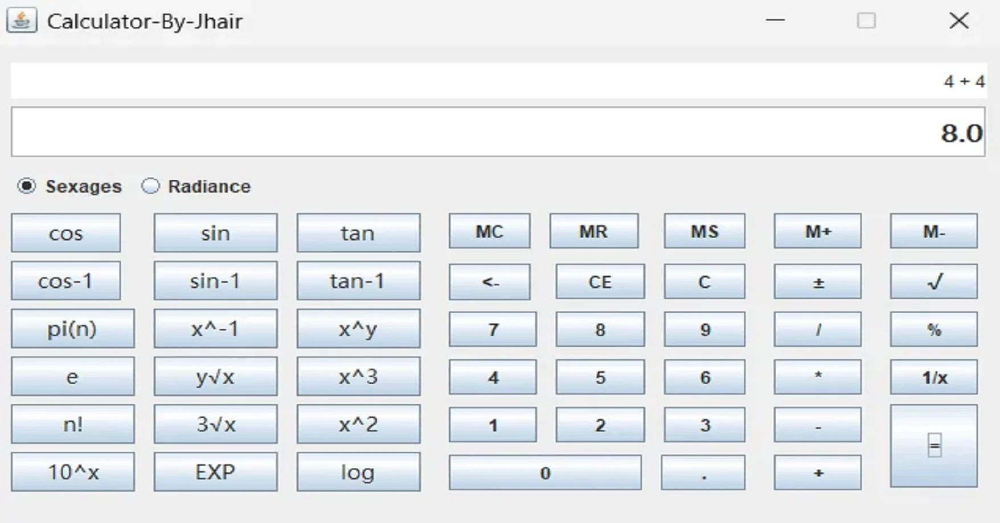

<div align="center">
    <a href="https://github.com/JheysonJhair/app_java_scientific_calculator">
      
    </a>
    <h1>JhairDev - Calculadora Científica</h1>
    <p align="center">
        Full Stack Developer Jhair
    </p>
</div>



# Calculadora Científica

Bienvenido a la **Calculadora Científica**, una aplicación avanzada diseñada para realizar cálculos matemáticos complejos, incluyendo funciones trigonométricas, logarítmicas y exponenciales, entre otras. Esta herramienta está orientada a usuarios que necesitan realizar cálculos científicos y de ingeniería de manera precisa y rápida.

## Tecnologías Utilizadas

- **Java**: El lenguaje principal utilizado para implementar la lógica de la aplicación.

---

## Instalación

1. **Requisitos previos**:
   - Tener instalado **Java JDK 17** o superior.

2. **Clonar el repositorio**:
   ```bash
   git clone https://github.com/JheysonJhair/app_java_scientific_calculator
   cd app_java_scientific_calculator
